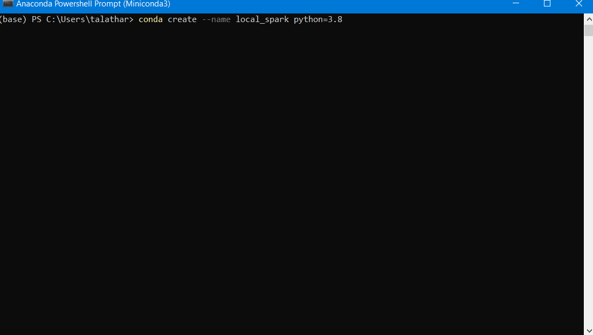

Spark came as an alternative to Hadoop's Mapreduce. It is an inmemory data processing framework that can facilitate
fast paced development of data application.

Spark has a tight integration which allows to run SQL query alongside python, java, scala , R and complex algorithms. It
has unified data access which allows to read from structured and unstructured data including apache hive tables, cassandra,
snowflake,sql, json, parquet, avro etc and many more file formats.

Installation for Practice with Pyspark in Local settings
=============================================================

Install Anaconda
----------------

Anaconda or Miniconda can be installed on your machine. Miniconda installation will be quicker than Anaconda.

.. _Miniconda: https://docs.conda.io/en/latest/miniconda.html

Create environment
-----------------------

Now you would have to create environment using which practice could be carried out.

.. code-block:: python

    conda create --name local_spark python=3.8

